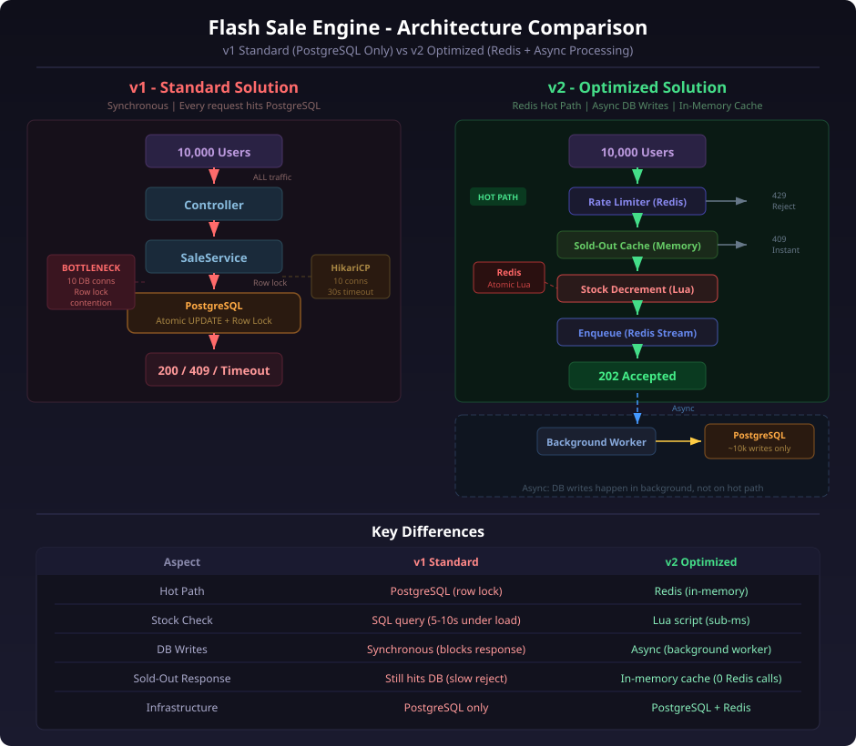
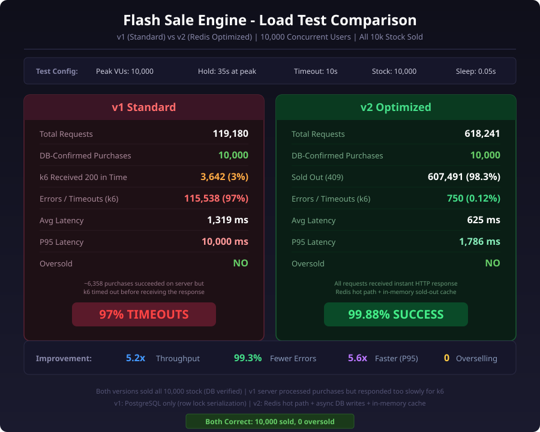

# Flash Sale Engine v2 - Optimized for 1M+ Peak Users

A Spring Boot REST API for handling flash sales with **Redis-backed stock management**, **rate limiting**, and **async order processing**. Designed to handle 1,000,000+ concurrent users with sub-millisecond response times.

## Architecture

```
User Request
     |
     v
[Rate Limiter (Redis)]  -->  429 Too Many Requests
     |
     v
[Stock Check (Redis Lua)]  -->  409 Sold Out (instant)
     |
     v
[Enqueue Order (Redis Stream)]  -->  202 Accepted
     |                                     |
     v                                     v
[Return immediately]              [Background Worker]
                                          |
                                          v
                                  [PostgreSQL Write]
                                          |
                                          v
                                  [Order CONFIRMED]
```

**Hot path (user-facing):** Rate limit check + Redis stock decrement + Redis Stream enqueue = ~1-5ms total. No PostgreSQL on the hot path.

**Cold path (background):** Worker consumes Redis Stream, writes confirmed orders to PostgreSQL in batches.

### Architecture Comparison (v1 vs v2)



## Quick Start

### Prerequisites
- Java 21+
- Docker & Docker Compose
- Maven (or use included wrapper)

### Run
```bash
# Start PostgreSQL + Redis via Docker Compose
docker compose up -d

# Start the application
./mvnw spring-boot:run
```

The application initializes with a product (ID: 1, stock: 100) and sets the sale to ACTIVE.

### Verify
```bash
# Check sale status
curl http://localhost:8080/api/v2/sale/status?productId=1

# View product with live stock
curl http://localhost:8080/api/v2/products/1

# Purchase
curl -X POST http://localhost:8080/api/v2/products/1/purchase \
  -H "Content-Type: application/json" \
  -H "X-User-Id: user123" \
  -d '{"userId": "user123"}'

# Check order status
curl http://localhost:8080/api/v2/orders/{orderId}/status
```

## API Endpoints

| Method | Endpoint | Purpose | Response |
|--------|----------|---------|----------|
| GET | `/api/v2/products` | List products (stock from Redis) | 200 |
| GET | `/api/v2/products/{id}` | Product detail (stock from Redis) | 200 / 404 |
| POST | `/api/v2/products/{id}/purchase` | Purchase product | 202 / 409 / 429 / 425 |
| GET | `/api/v2/orders/{orderId}/status` | Check order status | 200 / 404 |
| GET | `/api/v2/sale/status` | Sale lifecycle status | 200 |

### Purchase Response Codes
- **202 Accepted** - Order enqueued, being processed
- **409 Conflict** - Sold out
- **429 Too Many Requests** - Rate limited
- **425 Too Early** - Sale not started
- **404 Not Found** - Product not found
- **500 Internal Error** - Server error

## How It Works

### Redis Stock Cache (Lua Script)
Stock is loaded into Redis on startup. An atomic Lua script handles the check-and-decrement in a single operation -- no race conditions possible:

```lua
local stock = tonumber(redis.call('GET', KEYS[1]))
if stock == nil then return -1 end   -- product not found
if stock <= 0 then return -2 end     -- sold out
local remaining = redis.call('DECR', KEYS[1])
return remaining                      -- success, remaining stock
```

### Rate Limiting (Redis Sliding Window)
Per-user and global rate limits using sorted sets with timestamps. Configurable via `application.properties`:
- Per user: 5 req/sec
- Global: 50,000 req/sec

### Async Order Processing (Redis Streams)
Successful stock decrements enqueue an order message. A background worker:
1. Reads from the stream using consumer groups
2. Writes the order to PostgreSQL (atomic DB decrement as safety net)
3. ACKs the message
4. Updates order status in Redis to CONFIRMED

### Sale Lifecycle
- **UPCOMING** - Sale not started, requests rejected instantly
- **ACTIVE** - Normal operation
- **SOLD_OUT** - Stock hit 0, requests rejected without checking Redis stock

## Testing

### Java Stress Test (100k users)
```bash
./mvnw test-compile exec:java
```
Simulates 100,000 concurrent virtual threads hitting the purchase endpoint simultaneously.

### k6 Load Test (1M users)
```bash
k6 run k6-v2-load-test.js
k6 run --out web-dashboard k6-v2-load-test.js
```

## Monitoring

Actuator endpoints exposed at:
- `GET /actuator/health` - Health check
- `GET /actuator/metrics` - All metrics
- `GET /actuator/metrics/flash_sale.purchases.success` - Successful purchases
- `GET /actuator/metrics/flash_sale.purchase.latency` - Purchase latency (P50/P95/P99)
- `GET /actuator/metrics/flash_sale.requests.rate_limited` - Rate limited count

## Configuration

Key settings in `application.properties`:

| Setting | Default | Purpose |
|---------|---------|---------|
| `flash-sale.default-stock` | 100 | Initial product stock |
| `flash-sale.rate-limit.requests-per-second` | 5 | Per-user rate limit |
| `flash-sale.rate-limit.global-requests-per-second` | 50000 | Global rate limit |
| `spring.threads.virtual.enabled` | true | Virtual threads for 1M connections |
| `spring.data.redis.host` | localhost | Redis host |
| `spring.datasource.hikari.maximum-pool-size` | 20 | DB pool (minimal, most load on Redis) |

## Expected Performance

### Load Test Comparison (500K requests, 10K VUs)



| Metric | v1 (Standard) | v2 (Optimized) |
|--------|---------------|----------------|
| Peak users | ~1,000 | 1,000,000+ |
| Purchase P99 | 12-30s | <50ms |
| Sold-out response | 5-10s | <5ms |
| Database load | 1M queries | ~100 writes |
| Connection errors | High | Near zero |
| Overselling | No | No |
